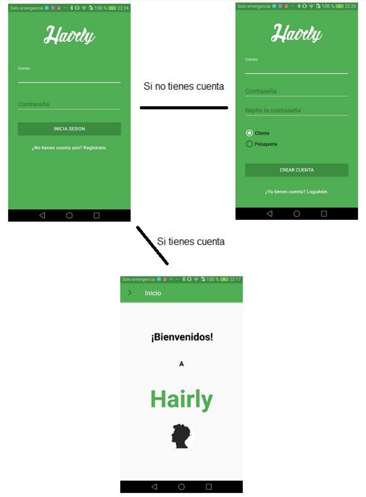
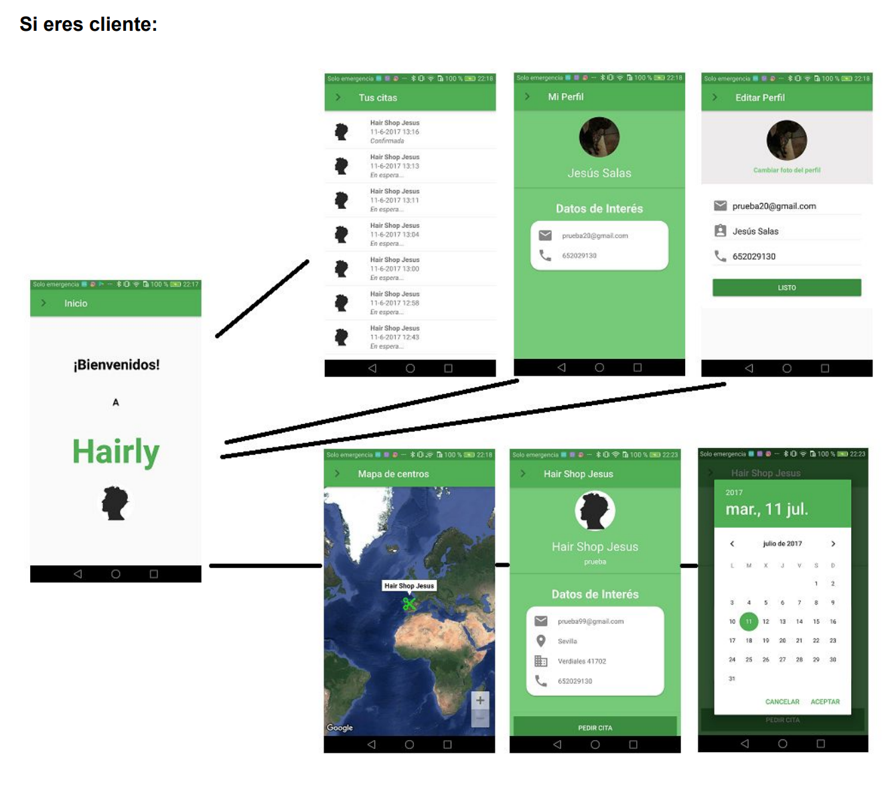
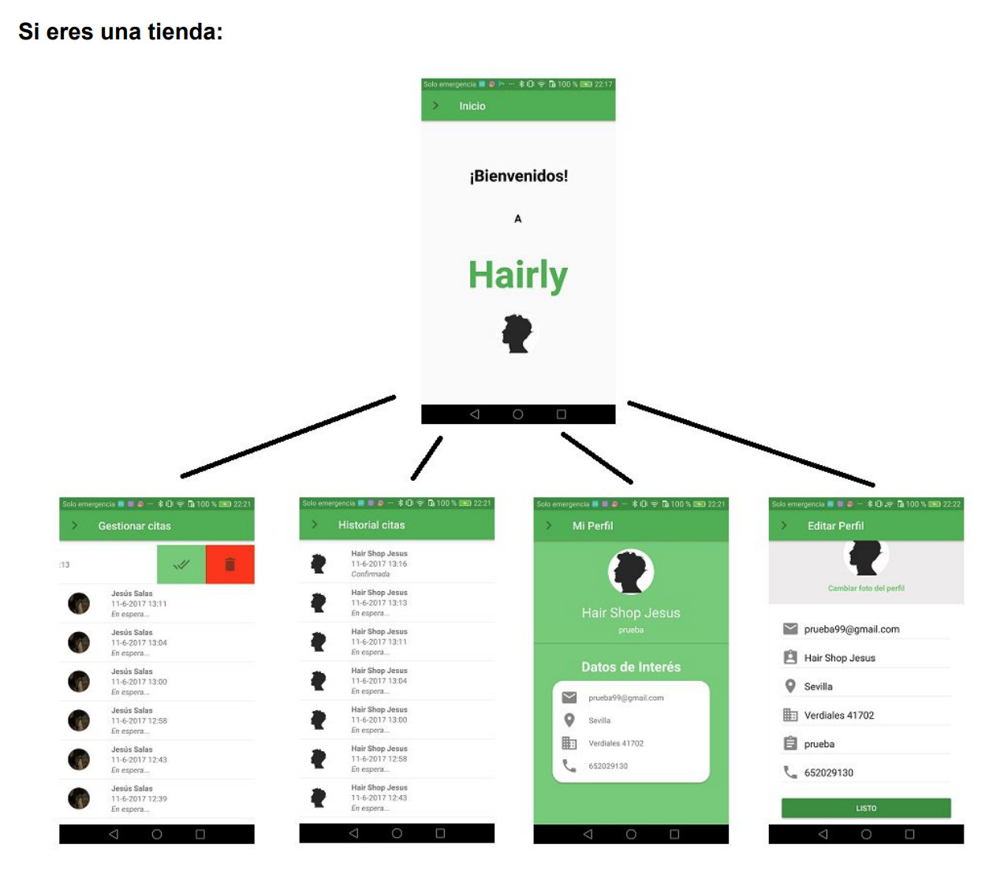

# Hairly
Application for hairdressers community and to get an appointment.

Used libraries:

● Butterknife

● Firebase

● RecyclerView

● Google Maps Geocoding API (geocodificación)

● Fresco

● JobManager

I attach images:

Login:

If you're a client:

If you're a client:

